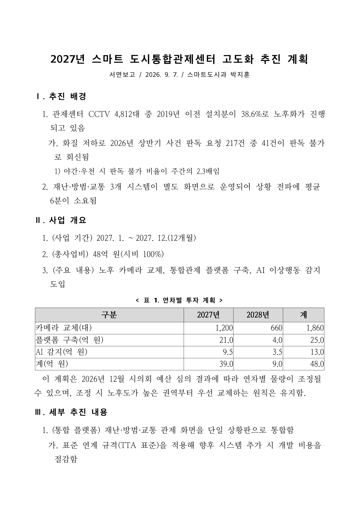
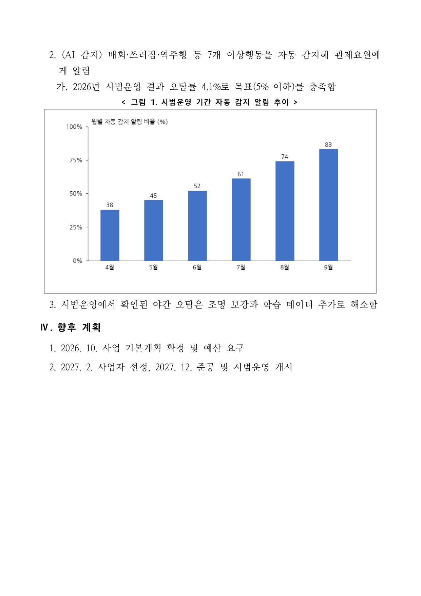
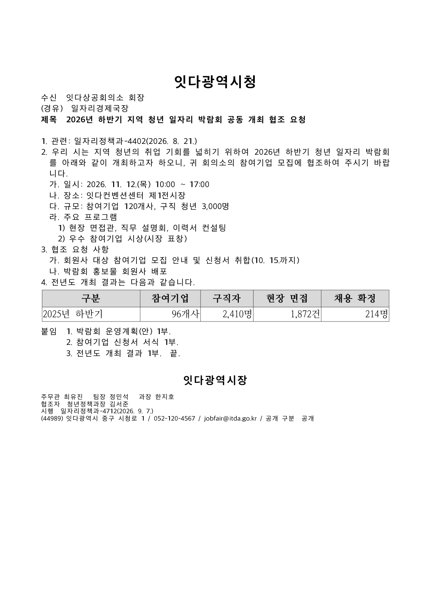
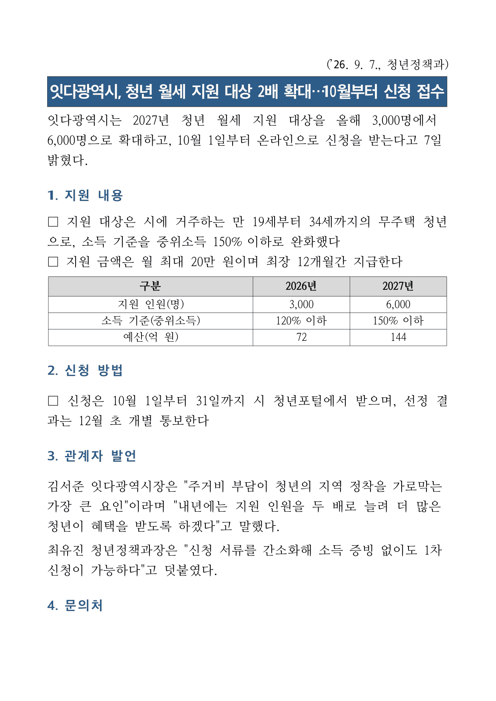
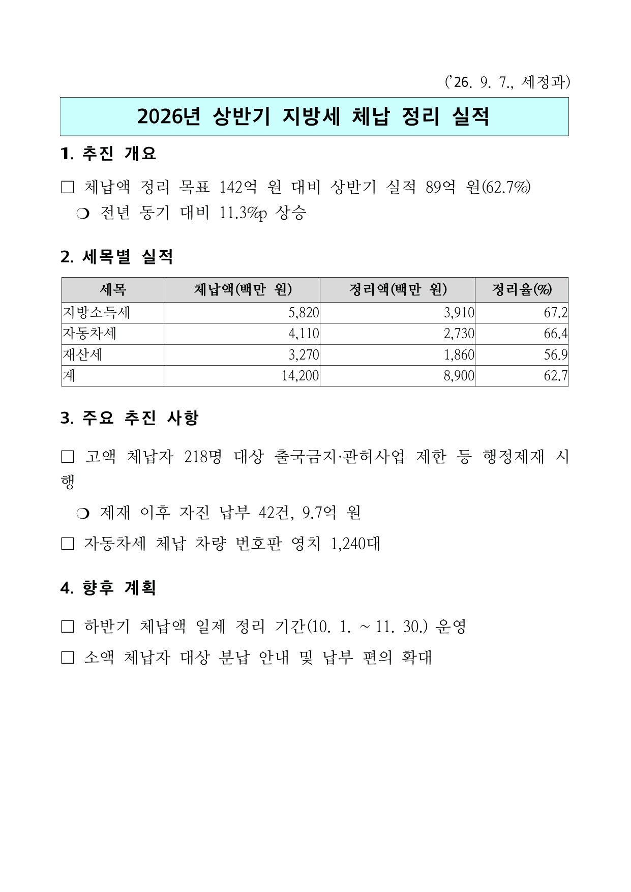
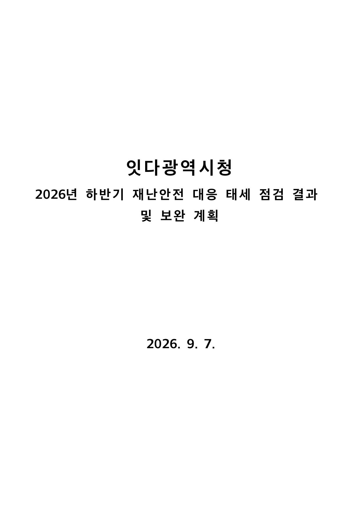
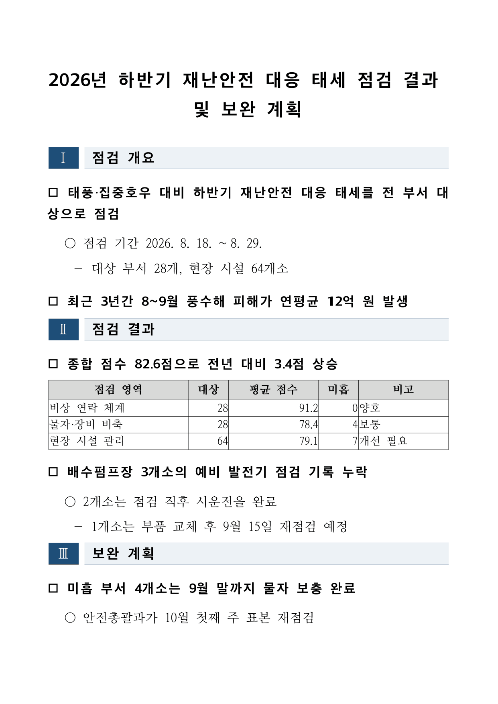

# hwpx — 한글 문서 스킬 활용 가이드 (v1.3)

한글(.hwp/.hwpx) 문서를 **읽고**, **우리 기관 양식을 채우고**, **정부·공공기관 서식으로 새로 만들고**, **참고 문서의 서식을 빌려 쓰는** 일을
한 스킬로 처리합니다. 외부 프로그램 없이 스킬 단독으로 동작하며, 이 문서의 모든 예시는 실제로 만들어 본 문서(§9 샘플 카탈로그·현업 케이스북 20종)에서 나왔습니다.

요청은 `/hwpx` 뒤에 자연어로 적으면 됩니다. 파일은 대화에 첨부하거나 경로를 말해 주세요.

---

## 0. 한눈에 — 기능 지도

| 하고 싶은 일 | 이렇게 말하세요 | 나오는 것 |
|---|---|---|
| 한글 문서 읽기·요약·변환 | `/hwpx 이 HWP 읽어줘` · `/hwpx 이 문서 HTML로, 서식 그대로` | 마크다운(+이미지 파일) 또는 단일 HTML |
| 우리 기관 양식에 값만 채우기 | `/hwpx 이 양식 파일 빈칸 채워줘. 부서는 정보통신과, 담당자는 김서준` | 양식 사본에 값 채움(서식·표·번호 그대로) — 안내문 자리·빈 셀·체크박스 |
| 보고서·계획·현황·결과보고 (기본) | `/hwpx 어르신 스마트기기 교육 확대 추진계획을 한글 보고서로 만들어줘. 과정별 편성표랑 예산표 넣어서` | **AI 친화적 보고서** — 행정안전부 2026-08 원칙(장식 없는 텍스트 우선 서식) |
| 공문·기안문·협조 요청·안내 | `/hwpx 상공회의소에 세무 상담 부스 협조 요청 공문 써줘. 붙임으로 운영계획 1부` | **기안문** — 항목기호·붙임·끝·발신명의·시행 정보 자동 |
| 보도자료 | `/hwpx 이 내용 보도자료로 뽑아줘. 시장 발언 인용 넣고` | 제목 박스 + 절 제목 + 산문 리드문·인용 + 표 |
| 예전 방식 개조식(제목 박스·□/❍) | `/hwpx 예전 정부 개조식 서식으로` | 구 정부 범용 서식 |
| 표지·목차가 있는 결재용 보고서 | `/hwpx 정보보안 점검 결과, 표지·목차 붙여서 결재용으로` | 표지·목차·로마숫자 섹션바·□○―※ (장식형 — 이렇게 지목할 때만) |
| 우리 기관 서식으로 새 문서 | `/hwpx 이 보고서 서식처럼 새 안건 써줘 (참고 hwpx 첨부)` | 참고 문서의 용지·글꼴·항목 서식을 뽑아 그 서식으로 생성(본문 서식 근사) |

**원칙 하나 — 파일을 함께 주면 새 서식을 만들지 않습니다.** 기관 서식이 정답이기 때문입니다.

- 빈칸·안내문 양식(신청서·정산서·"입력하세요" 문구) → **채웁니다**. "이 양식으로 보고서 써줘"가 그 신호입니다.
- 완성된 참고 문서 + 새 내용("이 서식처럼 써줘") → **서식을 뽑아 새로 씁니다**.
- 어느 쪽인지 애매하면 한 번 되묻습니다. `.hwp`(구형)는 읽기만 되므로 한글에서 `.hwpx`로 저장해 주세요. PDF·스캔본 서식은 흉내 내지 못하니 구조(제목·절·표)를 물어 기본 서식으로 만듭니다.

---

## 1. 시작 전에

### 1.1 알려 주면 좋은 것

| 문서 | 꼭 필요한 정보 | 있으면 좋은 정보 |
|---|---|---|
| 보고서 | 제목, 내용(또는 메모·회의록 원문) | 보고일, 부서, 담당자, 보고 유형(서면보고·대면보고·회의결과보고), 절 번호 체계(1. / Ⅰ.), 항목 체계(○ - · / 가. 1) 가)) |
| 기안문 | 제목, 수신(없으면 내부결재), **발신명의**(기관장 등), 본문 | 문서번호(처리과명-일련번호), 기안자·검토자·결재권자(직위 성명), 협조자, 주소·전화·전자우편, 붙임 목록, 공개 구분 |
| 보도자료 | 제목, 리드문, 부서 | 인용 발언, 문의처, 표 |
| 양식 채우기 | 양식 파일, 채울 값 | 어느 자리가 무엇인지(모르면 스킬이 전수 목록을 보여 줍니다), 일부러 남길 고정 문구 |
| 참고 서식으로 생성 | 참고 `.hwpx`, 새 내용 | 보고서 종류(AI 친화·구 개조식) |
| 읽기 | 파일 | 이미지 필요 여부, 표를 풀어 읽을지 그대로 둘지 |

날짜는 `2026-09-10` / `26. 9. 10.` / `2026. 9. 10.` 어느 형식이든 됩니다. 스킬이 공문서 표기(`2026. 9. 10.`)로 맞춥니다. "2026년 9월 10일"처럼 쓰면 해석하지 못해 경고가 뜨고 원문 그대로 실립니다.

### 1.2 처리 방식

- 입력 파일은 원본을 건드리지 않고 작업 사본에서 처리합니다. 채우기 결과는 항상 **새 파일**입니다.
- 스킬은 **생성·채움 뒤 결과를 읽기 경로로 다시 열어 확인**하는 것까지가 한 사이클입니다. "만들었으니 확인해 봐"라고 따로 말하지 않아도 됩니다.
- 경고는 그대로 전달됩니다. 경고가 없다고 규정에 맞는 것은 아닙니다 — 스킬은 구조를 지킬 뿐 문장·경어·용어는 보지 않습니다.
- 최종 렌더 확인은 한글에서 여는 것이 정본입니다(스킬은 한글을 실행하지 않습니다).

---

## 2. 읽기 — 한글 → 마크다운·HTML

| 의도 | 말하기 | 결과 |
|---|---|---|
| 내용 파악·요약(기본) | `/hwpx 이 HWP 읽어줘` | 마크다운 + 이미지 파일 추출(문서 이름 폴더에 `image_0001.png`…) |
| 본문만 빠르게 | `/hwpx 이미지 빼고 본문만 읽어줘` | 이미지 자리에 생략 표시만 남고 파일은 만들지 않음 |
| 이미지 설명까지 | `/hwpx 읽고 이미지 설명도 달아줘` | 이미지마다 한국어 1~2문장 설명을 붙임(10개가 넘으면 전체·일부·건너뛰기를 물음) |
| 원본 구조 그대로 열람 | `/hwpx 이 문서 HTML로, 서식 그대로` | 단일 HTML(이미지 내장, 글꼴·색·셀 정렬 보존) |
| 표를 사람이 읽게 | `/hwpx 표는 풀어서 읽기 쉽게 정리해줘` | 레이아웃·키-값 목적 표를 불릿·들여쓰기로 |
| 비교표는 그대로 | `/hwpx 표는 그대로 유지하고 마크다운으로` | 마크다운 표 보존(교차분석표·시간표 등) |
| 요약·발췌 | `/hwpx 이 공문 읽고 우리가 해야 할 일만 정리해줘` | 읽은 뒤 대화로 정리 |

- 기본은 **마크다운 변환 후 표 평탄화**입니다. 행·열 교차가 중요한 표(비교표·수치 매트릭스)만 표로 남기고, 키-값·양식·레이아웃 표는 목록으로 풉니다. "원본 그대로", "테이블 유지"라고 하면 평탄화를 건너뜁니다.
- HTML 은 원본 구조 보존용입니다. 평탄화·이미지 설명을 적용하지 않고, 표 열 정렬(왼쪽·오른쪽)이 남습니다. 표 정렬을 확인하려면 HTML 로 보세요.
- 이 스킬이 만든 문서를 읽으면 **제목 박스는 글상자 텍스트로, 섹션 바는 `| Ⅰ |  | 추진 배경 |` 표로** 나옵니다. 결함이 아니라 원본 구조입니다.
- `.hwp`(구 형식)는 제목 자동 감지·하이퍼링크 추출이 안 되고, 수식·차트 같은 OLE 개체는 완전히 복원되지 않습니다.
- **배포용 보호 문서**와 **암호 문서**는 읽을 수 없다고 명시 에러가 납니다. 우회 경로는 없습니다 — 한글에서 보호를 해제한 원본을 받으세요.

---

## 3. 서식 생성 — 마크다운 → 한글 문서

내용을 주면 Claude 가 규약에 맞는 마크다운을 먼저 쓰고 한글 문서로 변환합니다. 메모·회의록 원문을 주면서 "보고서로 정리해줘"라고 해도 됩니다.
내용을 먼저 확인하고 싶으면 `/hwpx 마크다운으로 먼저 보여줘, 확인하면 hwpx로 만들어줘`.

### 3.0 서식 고르기

| 서식 | 언제 | 특징 |
|---|---|---|
| **AI 친화적 보고서**(권장 기본) | 보고서·계획·현황·결과·검토·회의결과 | 행안부 2026-08 원칙 — 장식 표 없음, 평문 제목 + 메타 줄, `1.` 절 제목, ○/-/· 서술식, 표·그림 위 제목 |
| 기안문(공문) | 협조 요청·안내·제출 요청·통보·내부결재 | 수신·(경유)·제목, 항목기호 `1. 가. 1) 가)` 자동, 붙임·`끝.`, 발신명의·시행 정보 |
| 보도자료 | "보도자료로" | 제목 박스 + 절 제목 + 산문 리드문·인용문 보존 + 표 |
| 구 정부 개조식 | "예전 개조식 서식으로", 기관 관례가 그 형태일 때 | 머리글 `(’26. 9. 6., 부서명)` + 하늘색 제목 박스 + □/❍ 2단 + 표. 행안부 원칙의 "적용 전" 형태라 요청할 때만 |
| 표지목차형 | "표지·목차 붙여서 결재용으로" | 표지 → 목차(Ⅰ~, [붙 임]) → 남색 로마숫자 섹션바 + □ ○ ― ※ 4단. 장식형이라 지목할 때만 |

서식을 말하지 않으면 AI 친화적 보고서입니다.

> 아래 §3.1~3.5 의 그림은 이 스킬이 §9 샘플을 **실제로 만들어** 편 쪽입니다. 다만 한컴이
> 아니라 오픈소스 렌더러 [rhwp](https://github.com/edwardkim/rhwp) 로 그린 것이라 글꼴·자간이
> 한컴에서 열었을 때와 조금 다를 수 있습니다 — 구성(제목·절·표·캡션·항목 계층)은 그대로입니다.

### 3.1 AI 친화적 보고서 (권장 기본)

행정안전부가 2026년 8월 24일부터 실·국장 보고서까지 전면 적용한 방식입니다. 원칙은 둘입니다.

1. **표·그림은 위에 제목과 번호**를 달고, 셀 병합·표 안의 표를 쓰지 않는다.
2. **문장은 서술식**(주어·서술어가 있는 완결 문장)으로 쓰고, 항목 표시를 표준화(Ⅰ. 1. 가. 1) 가))하며, 꾸미기용 표·박스를 두지 않는다.

이 스킬은 그 원칙을 코드가 집행합니다. 제목 박스·섹션 바를 만들지 않고, 표·그림 위에 `< 표 1. 제목 >`을 자동으로 붙이며, 제목이 없으면 경고합니다.

#### 나오는 모양

아래는 §9 샘플 01 을 실제로 만들어 편 것입니다(2쪽 문서의 1·2쪽).





#### 각 부분의 이름

```
                스마트 행정 도입 추진 계획            ← 제목(굵게, 가운데)
        서면보고 / 2026. 9. 6. / 정보화담당관 김서준   ← 메타 줄

1. 추진 배경                                          ← 절 제목(굵게)
 ○ 직원들의 민원 처리 시간 단축 요구가 지속적으로 제기되고 있음
   - 정보화담당관이 2026년 상반기 설문조사를 실시한 결과, 68%가 개선이 필요하다고 응답함

2. 주요 내용
 ○ (추진절차) 희망부서 접수, 심사, 시행부서 확정의 3단계로 추진함
              < 표 1. 스마트 행정 도입 세부 추진절차 >  ← 표 위 제목(가운데, 굵게)
   ┌──────┬──────────────┬──────┐
   │ 단계 │ 내용          │ 일정 │
   ...
 이 계획은 담당자 협의회 결과에 따라 일부 조정될 수 있으며, 조정 내용은 별도로 보고함.   ← 산문 문단(들여쓰기)
```

#### 이렇게 말하면 됩니다 (실제로 만들어 본 9종)

| 유형 | 지침 예 | 붙는 선택 |
|---|---|---|
| 사업 추진 계획 | `/hwpx 어르신 스마트기기 활용교육 확대 추진계획을 한글 보고서로. 과정별 편성표와 예산표 넣어줘` | 기본 |
| 추진 현황(중간) | `/hwpx 상수관로 정비 중간보고서 써줘. 절 번호는 로마숫자로, 공구별 공정률 표 포함` | 절 번호 Ⅰ. Ⅱ. |
| 결과 보고 | `/hwpx 청년창업 지원사업 결과보고서. 연도별 실적이랑 분야별 성과를 표로` | 기본 |
| 회의 결과 보고 | `/hwpx 어제 재난안전 대책회의 결과보고 정리해줘. 참석자·결정사항·후속조치 나눠서, 항목기호는 가. 1) 방식으로` | 항목 `가. 1) 가)` |
| 검토·건의 보고 | `/hwpx 공영주차장 요금 개편 검토보고. 대안 3개 비교표 넣고 건의사항까지` | 기본 |
| 그림 포함 현황 보고 | `/hwpx 민원앱 이용률 현황보고 만들어줘. 이 그래프 이미지 넣고 기능별 이용건수 표도` | 이미지 파일 |
| 표준 체계 계획서 | `/hwpx 관제센터 고도화 추진계획, 절은 로마숫자에 항목은 가. 1) 체계로, 투자 표랑 알림 추이 그래프 넣어서` | 절 Ⅰ. + 항목 `1. 가. 1)` |
| 한 쪽 대면보고 | `/hwpx 발급기 장애 현황 대면보고, 짧게` | 보고유형 대면보고 |
| 표 여러 개 결과보고 | `/hwpx 놀이시설 점검 결과보고, 분야별·조치·권역별 표 세 개` | 기본 |

#### 작성 규약 (Claude 가 쓰는 마크다운 — 직접 쓸 때도 같습니다)

```markdown
---
title: 어르신 스마트기기 활용교육 확대 추진 계획
report_date: 2026. 9. 7.
dept: 평생교육과
보고유형: 서면보고
담당자: 박지훈
---

## 추진 배경                                   ← 절. 번호는 자동(1. 2. …)
- 65세 이상 인구의 디지털 정보화 수준이 낮은 상태가 지속되고 있음      ← ○
  - 2026년 상반기 조사 결과 이용 비율은 31.2%에 그침                     ← -
    - 특히 75세 이상은 18.7%임                                          ← ·

## 세부 추진 내용
- (교육과정) 기초·심화·생활응용 3개 과정으로 나누어 운영함

< 표 1. 과정별 편성 계획 >                      ← 표 바로 위 줄. "표 1." 은 안 써도 자동
| 과정 | 대상 | 정원 |
| :-: | :-- | --: |
| 기초 | 스마트폰 첫 사용자 | 400 |

이 계획은 협의회 결과에 따라 조정될 수 있음.     ← 산문 문단은 그대로 문단으로 남습니다

< 그림 1. 이용률 추이 >                          ← 이미지 위 제목 줄(또는 대체텍스트)

```

| 요소 | 규칙 | 어기면 |
|---|---|---|
| 절 | `## 제목`. 번호를 붙이지 않으면 `1. 2. 3.`(또는 `Ⅰ.`) 자동 | 일부 절에만 번호를 쓰면 스킬이 전부 벗기고 다시 매깁니다 — 체계는 하나여야 하기 때문 |
| 항목 | `- ` 들여쓰기 3단까지 → `○` `-` `·` (또는 `가.` `1)` `가)`) | 4단 이상은 3단으로 접히고 **상위의 형제 번호**를 받습니다(종속 관계 소실). 문장을 합치거나 절을 나누세요 |
| 문장 | "~함/~임/~음" 또는 완결 문장. 주어를 넣는다 | 스킬이 문체를 고치지는 않습니다 — "조각 명사구"는 그대로 나갑니다 |
| 표 제목 | 표 **바로 위** 줄에 `< 제목 >` | 없으면 `< 표 1 >`만 나가고 경고. 제목과 표 사이에 다른 문장이 끼면 제목이 버려지고 경고 |
| 표 번호 | 쓰지 마세요. 등장 순서로 자동 | `표 7.`처럼 쓰면 무시되고 경고. `표준 …`처럼 낱말이 "표"로 시작해도 번호로 오인하지 않습니다 |
| 표 구조 | 헤더 1행 + 데이터. 숫자 열은 구분선 `--:` | 행의 셀이 헤더보다 많으면 잘리고 경고, 적으면 빈 셀(경고 없음) |
| 그림 | `` 또는 위 줄에 `< 제목 >` | 둘 다 없으면 `< 그림 1 >`만 나가고 경고. 인터넷 주소 이미지는 제외. 큰 이미지는 본문 폭에 맞춰 비율 유지 축소 |
| 강조 | 표 셀 안 `**굵게**`만 보존 | 본문 굵게는 평문이 됩니다 |
| 항목 기호 직접 입력 | `□ …`, `○ …`처럼 기호를 직접 써도 됩니다(기호가 뜻하는 계층으로 들어감) | `※ …`는 4단 기호라 AI 보고서(3단)에서는 `·` 항목으로 접힙니다. "※ 참고" 문구를 그대로 두려면 기호 없이 산문으로 |

front-matter 선택 항목 (한글 키·영문 키 모두 됩니다):

| 키 | 값 | 효과 |
|---|---|---|
| `보고유형` (`report_type`) | 서면보고·대면보고·회의결과보고 … | 메타 줄 첫 칸 |
| `담당자` (`drafter`) | 이름 또는 직위 성명 | 메타 줄 끝(부서 뒤) |
| `section_numbering` | `digit`(기본) / `roman` | 절 번호 `1.` / `Ⅰ.` |
| `item_markers` | `symbol`(기본) / `outline` | 항목 `○ - ·` / 표준 개요 체계(절이 `1.`이면 `가. 1) 가)`, 절이 `Ⅰ.`이면 `1. 가. 1)`) |

말로 하면 됩니다 — "절 번호는 로마숫자로", "항목은 가. 1) 체계로", "대면보고로".

#### 자주 나오는 경고와 처방

| 경고 | 뜻 | 처방 |
|---|---|---|
| `표 N개에 제목이 없어 '< 표 N >' 로만 표기됩니다` | 표 위 제목 줄 없음 | 표 바로 위에 `< 제목 >` 한 줄 |
| `그림 N개에 제목이 없어 …` | 이미지 제목·대체텍스트 없음 | `` |
| `'< 표 7. … >' 의 번호는 무시되고 등장 순서(표 2)로 매겨집니다` | 손으로 쓴 번호 | 제목만 쓰기 |
| `표·그림 제목 줄 '< … >' 뒤에 표나 이미지가 없어 버렸습니다` | 제목과 표 사이에 다른 줄 | 제목을 표 바로 위로 |
| `4단계 이상 중첩 항목을 level 3 로 clamp 했습니다 — … 형제 번호를 받아 …` | 너무 깊은 계층 | 문장 합치기·절 나누기 |
| `표의 일부 행이 헤더 열 수를 초과해 절단했습니다` | 셀 수 불일치 | 각 행의 `\|` 수를 헤더와 맞추기 |

#### 품질 점검표 (생성 뒤 확인)

- [ ] 모든 표·그림 위에 `< 표 N. 제목 >` / `< 그림 N. 제목 >`이 있고 번호가 1부터 이어진다
- [ ] 각 항목이 주어와 서술어를 갖춘 문장이다 ("추진", "검토 중" 같은 조각이 남지 않았다)
- [ ] 수치에 기준 시점·단위·비교 대상이 붙어 있다 (`60.4%` → `2026. 8. 31. 기준 공정률 60.4%`)
- [ ] 절 번호 체계가 하나다. 항목 계층이 3단 이내다
- [ ] 메타 줄에 보고유형·날짜·부서·담당자가 있다. 날짜가 `2026. 9. 7.` 형식이다
- [ ] 병합 셀·표 안의 표가 없다 (필요하면 기관 양식 + 양식 채우기 경로)

### 3.2 기안문(공문)

행정업무 운영 규정의 서식 원칙을 스킬이 집행합니다. 규정에서 자동으로 처리되는 것과 사용자가 챙길 것을 나눠 적습니다.

#### 나오는 모양



#### 각 부분의 이름

```
                     잇다구청                         ← 기관명(위 가운데)
수신  잇다구 상공회의소 회장
(경유)  행정지원국장
제목  지역 소상공인 세무 상담 부스 운영 협조 요청

1. 관련: 지역경제과-2201(2026. 8. 28.)
2. 우리 구는 2026년 하반기 … 함께 운영하고자 합니다.
3. 이에 아래와 같이 협조를 요청하오니 … 바랍니다.
  가. 협조 기간: 2026. 10. 6.(화) ∼ 2026. 10. 10.(토)
  나. 협조 내용
    1) 회원사 대상 사전 홍보 및 참여 신청 접수
    2) 상담 부스 운영 공간(30㎡ 내외) 대여
붙임  1. 운영 계획 1부.
      2. 참석자 명단 1부.  끝.

                    잇다구청장                         ← 발신명의(가운데, 굵게)
주무관 김서준   과장 이하나   국장 박정우               ← 서명 줄(용어 없이 직위 성명)
협조자  청년정책과장 김서준
시행  지역경제과-2415(2026. 9. 10.)
(04628) 서울특별시 잇다구 잇다로 52 / 02-1234-5678 / bizhelp@itda.go.kr / 공개 구분  공개
```

#### 이렇게 말하면 됩니다 (실제로 만들어 본 8종)

| 유형 | 지침 예 |
|---|---|
| 협조 요청(외부 기관) | `/hwpx 상공회의소에 소상공인 세무 상담 부스 협조 요청 공문 써줘. 기간은 10월 6일부터 10일까지, 우리가 세무사 3명이랑 기자재 대는 조건` |
| 협조 요청(경유·협조자·붙임 3·표) | `/hwpx 상공회의소에 박람회 협조 요청 공문, 경유는 국장, 협조자는 청년정책과장, 붙임 3건, 작년 실적 표 붙여서` |
| 개최 안내(붙임 2건) | `/hwpx 자치구 정보보호 실무협의회 개최 안내 공문. 9월 24일 오후 2시 시청 대회의실. 붙임은 운영계획이랑 참석자 등록 서식` |
| 자료 제출 요청(항목 4단) | `/hwpx 각 학과에 산학협력 실적 제출 요청 공문. 기한 9월 30일, 기술이전·공동연구 실적을 항목별로 세분해서` |
| 결과 통보(표 포함) | `/hwpx 청년창업 지원사업 선정 결과 통보 공문. 분야별 신청·선정 건수와 지원금은 표로` |
| 내부결재 기안 | `/hwpx 하반기 사무용품 일괄 구매 내부결재 기안문. 예산 1,240만 원, 구매 내역은 붙임으로` |
| 내부결재(부분공개) | `/hwpx 소방시설 점검 용역 내부결재 기안, 부분공개 5호로` |
| 한 줄짜리 안내 | `/hwpx 9월 19일 오전 소방점검 단수 안내 공문 한 줄짜리로` |

#### 규정에 따라 자동 처리되는 것

| 축 | 스킬이 하는 일 | 근거 |
|---|---|---|
| 항목기호 | 계층에 따라 `1.` → `가.` → `1)` → `가)` 자동 번호. 소스에 `1. 3. 7.`로 써도 `1. 2. 3.`으로 재매김 | 시행규칙 제2조제1항 |
| 항목이 하나뿐 | 그 계층의 항목이 하나면 기호를 붙이지 않음 (들여쓰기만) | "둘 이상의 항목으로 구분할 필요가 있으면" |
| 들여쓰기 | 1단계는 기본선, 하위 단계는 2타(한 글자)씩 오른쪽, 둘째 줄은 내용 첫 글자에 맞춤 | 행정업무운영 편람 |
| 날짜 | `2026. 9. 10.` (온점, 월·일 앞 0 없음) | 영 제7조제5항 |
| 붙임 | 1건은 번호 없이 `붙임  운영 계획 1부.`, 2건 이상은 `1. 2.` 번호, 마지막 뒤 2타 띄우고 `끝.` | 편람 |
| 끝 표시 | 붙임이 없으면 마지막 항목 문장 뒤 `  끝.`, 표로 끝나면 표 아래 왼쪽 기본선에서 `  끝.` | 편람 |
| 수신 없음 | `수신  내부결재`로 표기, `(경유)` 줄은 비워 둠 | 서식 |
| 서명 줄 | "기안자·검토자·결재권자" 용어를 쓰지 않고 내용(직위 성명)만 나란히 | 별지 제1호서식 비고 |
| 협조자·공개 구분 | 협조자 줄, 시행 정보 끝에 `공개 구분  …` | 서식 |

#### 사용자가 챙길 것 (front-matter — 말로 해도 됩니다)

```markdown
---
제목: 지역 소상공인 세무 상담 부스 운영 협조 요청
보고일: 2026-09-10                 ← 시행일
기관명: 잇다구청
수신: 잇다구 상공회의소 회장        ← 없으면 내부결재
경유: 행정지원국장                 ← 있을 때만
발신명의: 잇다구청장               ← 필수. 없으면 경고 + 그 줄 생략
기안자: 주무관 김서준              ← 직위 성명으로. 이름만 써도 됨
검토자: 과장 이하나
결재권자: 국장 박정우              ← `결재자:` 도 됩니다
협조자: 청년정책과장 김서준
문서번호: 지역경제과-2415
주소: (04628) 서울특별시 잇다구 잇다로 52
전화: 02-1234-5678
전자우편: bizhelp@itda.go.kr
공개구분: 공개                     ← 공개·부분공개(제5호)·비공개(제6호) 등
붙임: 운영 계획 1부. | 참석자 명단 1부.   ← `|` 로 구분, 각 항목은 "N부."로
---

1. 관련: 지역경제과-2201(2026. 8. 28.)     ← 선행 문서가 있으면 첫 항목으로 직접 씁니다
2. 본문 …
   - 하위 항목                              ← `-` 들여쓰기 = 가. 나.
     - 더 하위                              ← = 1) 2)
   가. 일시: …                              ← 규정 기호를 직접 써도 같은 계층. 1) 가) 도 됩니다
```

#### 함정

- **하위 항목이 하나뿐이면 기호가 사라집니다.** 규정 취지에 맞지만 놀랄 수 있습니다. 계층을 보이게 하려면 형제를 둘 이상 쓰거나 한 문장으로 합치세요.
- **항목 번호를 인용 목적으로 쓰지 마세요.** `3. 제7조제3항에 따라 …`라고 쓰면 `1.`로 재매김됩니다. 조항 번호는 문장 안에 넣습니다.
- **5단계 이상은 지원하지 않습니다.** 4단으로 접히면서 종속 관계가 사라집니다(경고). 규정의 `(1) (가) ① ㉮`가 필요하면 문장을 재구성하세요.
- **"2026년 9월 10일"은 해석되지 않습니다.** 경고가 뜨고 원문 그대로 실립니다.
- **경고가 없다고 규정에 맞는 것은 아닙니다.** 스킬은 구조를 지킬 뿐 문장·경어·용어는 보지 않습니다.
- **스킬이 만들지 않는 칸**: 접수(접수 기관이 채움)·팩스·홈페이지·관인·결재란 표. 기관 서식이 엄격하면 그 서식을 **양식 채우기**로 쓰세요.

#### 공문 점검표

- [ ] 제목·발신명의가 있다 (발신명의 누락은 경고로 알려 줍니다)
- [ ] 첫 항목이 `1. 관련: 처리과명-번호(날짜)`인가(선행 문서가 있을 때)
- [ ] 항목이 `1. → 가. → 1) → 가)` 순서로 매겨졌고 4단 이내다
- [ ] `끝.`이 한 곳에만 있다 (붙임 끝 / 표 아래 / 마지막 항목)
- [ ] 붙임이 2건 이상이면 번호가 붙었고 1건이면 번호가 없다
- [ ] 시행 줄이 `처리과명-번호(2026. 9. 10.)`다. 서명 줄에 "기안자" 같은 용어가 없다
- [ ] 시각은 24시각제(`14:00`), 기간은 `∼`, 법령명은 「 」

### 3.3 보도자료

`/hwpx 청년 월세 지원 보도자료, 시장·과장 발언 인용하고 규모 비교표 넣어서`

- 제목 박스 + 절 제목(`1. 2.`) + **산문 리드문·인용문은 문단 그대로** + 표. `- ` 항목은 □ 개조식이 됩니다.
- 첫 줄 아래에 `(’26. 9. 7., 부서명)` 머리글이 붙습니다. 부서를 말하지 않으면 `부서명`이 남습니다(경고).
- 인용문은 따옴표째 문장으로 써 주세요("…"며 "…"고 말했다). 문의처는 마지막 절에 부서·전화.



### 3.4 구 정부 개조식(gov-report)

`/hwpx 체납 정리 실적 예전 개조식으로, 숫자는 우측 정렬`

- 머리글 `(’26. 9. 7., 부서명)` + 하늘색 제목 박스 + `1. 2.` 절 + □/❍ 2단 + 표. 산문은 □ 항목으로 바뀝니다(경고).
- 행안부 AI 친화 원칙의 "적용 전" 형태입니다. 기관 관례가 이 형태일 때만 쓰세요. **빈칸 신청서 양식을 만들 때**도 이 서식이 쓰입니다(§4.4).



### 3.5 표지목차형(briefing)

`/hwpx 재난 대응 점검 결과 표지·목차 붙여서 결재용으로, 붙임 2건`

```markdown
---
title: 청사 주차장 야간 개방 시범운영 현안 보고
report_date: 2026-09-06
기관명: 스킬잇다시청
붙임: 이용 실태 분석표 | 관리 인력 배치안
---
## 현안 개요
- 인근 주민 요구로 8월부터 시범 운영           ← □
  - 운영 시간 평일 18:00 ~ 익일 08:00          ← ○
    - 1개월 누적 1,284대                        ← ―
      - 일평균 41대                             ← ※
```

- 표지(기관명·제목·작성일) → 목차(Ⅰ~, 붙임이 있으면 `[붙 임]` 자동) → 본문 제목 → 남색 로마숫자 섹션바 + 4단 항목. 페이지 나눔 2회.
- 장식형입니다. 표지 제목은 한 줄 안에 들어가게(약 20자).





---

## 4. 양식 채우기 — 우리 기관 양식에 값만

양식을 새로 그리지 않고 **원본 사본의 글자만 바꿔치기**하므로 표·번호·머리글·글꼴이 그대로입니다. 안내문 자리 치환, **빈 셀 채움**, **체크박스 표시**를 한 번에 할 수 있고,
채우기 전 **사전검증**과 채운 뒤 **잔재 대조**가 있어 안내문이 남은 채 결재로 나가는 것을 막습니다.

### 4.1 네 단계

1. **자리 확인** — `/hwpx 이 양식에 채울 자리 보여줘`. 양식 안 **문단 전부**를 번호·위치(본문 / 몇 번째 표의 몇 행 몇 열)·상태와 함께 보여 줍니다.
   빈 셀은 `EMPTY`, 탭·줄바꿈·필드가 낀 문단은 `CTRL` 로 표시됩니다. 괄호·`{{ }}`·《 》 마커 규약이 있는 양식이면 "채울 자리 후보만 보여줘"로 후보만 볼 수도 있습니다.
2. **값 정하기 + 사전검증** — 무엇을 무엇으로 바꿀지 정하면 스킬이 채우기 **전에** 키마다 판정합니다: 맞음 / 표기만 다름(중점·따옴표·물결·대시·공백 —
   원문 표기의 교정안을 줍니다) / 탭·줄바꿈을 가로지름(키를 나눌 위치를 알려 줍니다) / 문단 여러 개를 합친 키 / 없음 / 두 키의 교정안이 같은 자리로 겹침.
   하나라도 문제면 채우지 않습니다. `/hwpx 채우기 전에 키를 검사해줘`.
3. **채우기** — 사본을 만들어 채우고 자리마다 몇 번 채웠는지 보고합니다.
   - 같은 문구가 여러 번이면 순서대로 다른 값을 줄 수 있습니다("본문 안내 문구 3개는 순서대로 A, B, C").
   - **빈 칸**은 라벨("성명 옆에 김서준")이나 좌표("표0 2행 1열에 …")로, **체크박스**는 "개인정보 동의에 체크"로 채웁니다.
   - 못 찾은 자리와 값이 모자란 자리는 반드시 알려 줍니다. `/hwpx 빠짐없이 채워졌는지 엄격하게 확인해줘`라고 하면 하나라도 남으면 실패로 처리합니다.
4. **잔재 대조 + 확인** — 원본의 안내문(`입력하세요`·`작성해 주세요`·`써 주세요`·○○ 같은 문단)과 매핑한 문구가 결과에 남았는지, 그리고 넣기로 한 값이 실제로
   들어갔는지 전수 대조합니다. 걸리면 실패로 알립니다(일부러 남기는 법정 문구는 "그 문구는 그대로 둬"로 제외). 그 뒤 읽기 경로로 열어 눈으로 확인합니다.

```
/hwpx 이 양식 파일에 채울 자리를 먼저 보여줘
/hwpx 이 양식 사본에 채워줘 — 부서명은 정보통신과, 담당자는 김서준 주무관, 보고일은 9월 6일
/hwpx "세부 내용을 입력하세요" 세 칸은 순서대로 "예산 편성 지침 시달", "3분기 징수율 96.2%", "무인발급기 2대 설치"로
/hwpx 신청서 표에서 성명 옆 빈칸에 김서준, 연락처 옆에 02-1234-5678 넣고, 개인정보 수집 동의에 체크해줘
/hwpx 채운 결과에 안내 문구가 남았는지 원본이랑 대조해줘. "작성 후 제출" 문구는 원래 있는 거니까 그대로 둬
```

### 4.2 빈 칸·체크박스 채우기 (신청서·정산서형)

| 방법 | 말하기 | 동작 |
|---|---|---|
| 라벨로 | "성명 옆에 김서준" | 라벨과 **정확히** 같은 글자의 셀을 찾아 같은 행 바로 오른쪽, 없으면 바로 아래의 빈 셀에 넣음 |
| 좌표로 | "표0 2행 1열에 주소" | 자리 확인 목록의 좌표 그대로. 병합 셀은 왼쪽 위 좌표 |
| 체크박스 | "개인정보 동의에 체크" | `□ 개인정보 …` 의 □ 를 ☑ 로 |

- **체크박스는 □ 바로 뒤 글자부터** 지목합니다. `□ 신청 내용이 사실과 다를 경우 …`에 체크하려면 "신청 내용이 사실과"처럼 첫머리를 주세요. 문장 중간 낱말로는 찾지 못합니다.
- **라벨 방식이 거부되는 표**: 병합 셀이 있거나 표 안에 표가 든 표, 라벨과 같은 글자의 셀이 둘 이상인 경우(어느 칸이 "옆"인지 정의할 수 없어서). 그때는 좌표로 지정합니다.
- 값에 줄바꿈을 넣으면 셀 안 줄바꿈이 됩니다. 괄호 빈칸(`일반(  )통`)은 지원하지 않습니다.

### 4.3 함정 (전부 실측)

- **자리표시 규약이 없는 양식**은 "채울 자리 후보"가 0건으로 나옵니다. 정상입니다 — 전수 목록으로 고릅니다.
- **키에 항목 기호를 넣지 마세요.** 목록에 `□ 세부 내용을 입력하세요`로 보여도 키는 `세부 내용을 입력하세요`입니다. 기호까지 키로 주면 기호도 함께 사라집니다.
- **글꼴이 중간에 바뀌거나 조각난 자리도 그대로 채워집니다.** `(부서명)`이 `(부서` `명)`으로 나뉘어 저장돼 있어도 문단 단위로 찾으므로 키 하나면 됩니다. 값은 앞쪽 조각의 글꼴을 따릅니다.
- **눈으로 같아 보여도 다른 글자**(`추진·배경` vs `추진‧배경`, 물결·따옴표·대시)는 사전검증이 "표기만 다름"으로 잡고 교정안을 줍니다. 그 교정안대로 채우면 됩니다.
- **탭·줄바꿈·누름틀(필드)·그림·표를 건너뛰는 키는 절대 맞지 않습니다.** `연령⇥거주지`처럼 탭이 낀 문단은 목록에 `CTRL`로 표시되고, 사전검증이 "연령"과 "거주지"로 나누라고 알려 줍니다.
  한글이 셀 첫머리에 넣는 단 설정 같은 보이지 않는 레이아웃 정보는 문단을 나누지 않으므로 그런 셀은 정상적으로 채워집니다.
- **값이 모자라면 자리가 남습니다.** 경고를 내고, 엄격 확인을 요청하면 실패로 처리합니다. 잔재 대조는 매핑을 빠뜨린 안내문까지 잡습니다.
- **잔재 대조가 남긴다고 말하는 문구가 원래 양식의 고정 문구**(법정 안내 등)일 수 있습니다. "그건 그대로 둬"라고 하면 제외하고 다시 봅니다.
- **표지·목차·본문에 같은 문구가 2회 이상**이면 값 하나로 전부 바뀝니다. 다르게 넣고 싶을 때만 순서 값을 줍니다.
- 표 행 추가·이미지 삽입·서식 변경은 하지 않습니다(글자·셀 값·체크박스만). 그런 양식은 "생성" 경로로 새로 만들거나 한글에서 손봅니다.
- 한글이 결과 파일을 열며 **"손상된 파일을 복구"**를 띄우면 알려 주세요 — 줄 배치 캐시·미리보기를 새로 만드는 방식으로 다시 만들어 드립니다(기본은 끔.
  실제 한컴 저장 양식을 채운 결과를 한컴오피스 macOS 에서 열어 확인했을 때는 경고가 없었습니다).

### 4.4 빈칸 양식이 없으면 만들어서 채우기

마크다운 표에서 값 칸을 비워 두면(`| 성명 | | 연락처 | |`) 구 개조식 서식으로 만든 양식에 `EMPTY` 셀이 생기고, 체크 항목은 `□ …` 줄로 둡니다.
그 뒤는 라벨·좌표·체크 채우기 동선 그대로입니다(샘플 11). 스킬이 만든 표는 **첫 행이 머리글 서식**(굵게·채움)으로 나가므로, 첫 행에 라벨-값 쌍을 두면
"성명 | 김서준"이 머리글처럼 보입니다. 신경 쓰이면 첫 행을 열 제목(구분·내용)으로 두거나 기관 양식을 쓰세요(한컴 실측).

```
/hwpx 청년 창업 지원 신청서 양식 만들어줘. 신청인 정보(성명·생년월일·연락처·전자우편·주소) 표, 창업 계획 표, 동의 사항 체크박스 3개
/hwpx 그 양식에 성명 김서준, 생년월일 1998. 3. 14., 연락처 010-1234-5678 넣고 개인정보 동의에 체크해줘
```

### 4.5 점검표

- [ ] 원본은 그대로 두고 사본에 채웠다
- [ ] 사전검증에서 "없음·표기 다름·탭 가로지름·겹침" 판정이 0건이었다(있으면 교정안·나눔안대로 매핑 수정)
- [ ] `→ 0회`인 키가 없다
- [ ] `자리 N개가 값 없이 남았습니다` 경고가 없다
- [ ] 잔재 대조가 "잔재 없음"이다(남긴 고정 문구는 제외 목록에 있다)
- [ ] 읽기 경로로 열어 `입력하세요`·`(부서명)`이 남지 않았다
- [ ] 머리글·표지·목차까지 값이 반영됐다 (본문만 매핑하면 머리글이 남습니다)

---

## 5. 참고 서식으로 새 문서 — "이 서식처럼 써줘"

빈칸 양식이 아니라 **완성된 문서**(지난 보고서 등)를 주면서 새 내용을 써 달라는 경우입니다. 그 문서의 용지·여백·글꼴·제목/항목/산문/캡션 서식·표 서식을 뽑아
**AI 친화적 보고서(또는 구 개조식) 조판을 그 서식으로** 돌립니다. 내용 길이는 무관하고 서식만 사용자 것이 됩니다.

```
/hwpx 이 보고서 서식처럼 "청년 창업 지원 확대 계획" 써줘 (참고 hwpx 첨부)
/hwpx 우리 과 지난달 현황보고 서식으로, 이번 달 수치로 바꿔서 새로 만들어줘
/hwpx 이 서식대로 만들되 절 번호는 로마숫자, 항목은 가. 1) 체계로
```

- **가져오는 것**: 용지·여백, 본문 글꼴, 제목·절 제목·항목 1~3단·산문·캡션의 대표 서식(가장 많이 쓰인 것), 데이터 표의 테두리·머리글 서식. 표지가 앞 섹션에 있어도 본문이 가장 많은 섹션을 찾아 씁니다.
- **가져오지 않는 것**(경고 후 본문 서식만): 표지·결재란·머리말/꼬리말·쪽번호·두 번째 이후 섹션·문서에 내장된 글꼴. 기안문·표지목차형 조판은 이 방식을 지원하지 않습니다.
- **확인**: 생성 뒤 참고 문서와 속성(글꼴·크기·굵기·정렬·들여쓰기·용지·표 테두리)을 대조해 다르면 알립니다. "합성한 서식이 하나라도 있으면 실패로 봐줘"라고 하면 엄격하게 판정합니다.
- 못 찾은 층위(예: 참고 문서에 캡션이 없음)는 기본 서식을 참고 문서 글꼴로 맞춰 넣고 경고합니다. 실측(샘플 09 — 표지+본문 2섹션인 실제 기관 보고서): 제목·메타 줄·캡션 셋이 그렇게 합성됐고,
  나머지 항목·산문·표 서식은 참고 문서 것이 그대로 실렸습니다(대조 통과).
- 참고 문서에서 3단 항목이 굵은 글꼴이었다면 생성본의 3단도 굵게 나옵니다 — "대표 서식"은 원문의 습관을 그대로 옮깁니다. 서식을 문단마다 손으로 만진 문서는 대표 서식이 원본과 조금 다를 수 있습니다.
  최종은 한글에서 열어 보는 것이 정본입니다.

---

## 6. 조합 시나리오 — 세 경로를 이으면

| 시나리오 | 지침 |
|---|---|
| 반복 문서 자동화 | ① 생성으로 우리 팀 주간보고 양식을 만들되 바뀌는 자리는 `(부서명)`·`(업무1)`처럼 비워 둔다 ② 매주 채우기로 사본에 값만 넣는다(16개 자리 한 번에 실측) ③ 읽기로 확인. `/hwpx 지난주 주간보고 양식 사본에 이번 주 값 채워줘. 담당자는 김서준, 업무1은 보안 패치 서버 구축 45%` |
| 받은 공문 → 회신 기안 | `/hwpx 이 공문 읽고, 요청 자료를 제출하는 회신 기안문 써줘. 붙임은 실적표 1부` |
| 회의록 → 보고서 → 결재용 | `/hwpx 이 회의록으로 회의결과보고 만들어줘` → `/hwpx 같은 내용을 표지·목차 붙여서 결재용으로도` |
| 지난 보고서 서식 재사용 | `/hwpx 이 보고서 서식처럼 이번 분기 실적보고 써줘` (참고 hwpx 첨부) |
| 신청서 대량 접수 | 양식 하나를 만들어 두고(§4.4) 신청인마다 `/hwpx 이 신청서에 성명 …, 연락처 … 채우고 동의 체크해줘` |
| 문서 검토·요약 | `/hwpx 이 HWP 세 개 읽고 각각 핵심 결정사항만 표로 정리해줘` |

---

## 7. 경고 메시지 사전

| 메시지 | 어디서 | 처방 |
|---|---|---|
| `부서(dept)가 지정되지 않았습니다` | 구 개조식·보도자료 | 머리글에 `부서명`이 남습니다. 부서를 알려 주세요 |
| `발신명의(sender)가 없습니다` | 기안문 | 발신명의(기관장 등)를 알려 주세요 |
| `보고일 '…' 을 날짜로 해석하지 못해` | 기안문·AI 보고서 | `2026-09-10` 형식 |
| `표 N개에 제목이 없어` / `그림 N개에 제목이 없어` | AI 보고서 | 표·그림 바로 위 `< 제목 >` |
| `… 번호는 무시되고 등장 순서로` | AI 보고서 | 제목만 쓰기 |
| `N단계 이상 중첩 항목을 … clamp` | 모든 서식 | 계층 줄이기 |
| `N개 일반 문단을 □ 항목으로 변환했습니다` | 구 개조식·보도자료 | 개조식이 맞으면 무시. 산문이 필요하면 AI 보고서·보도자료 |
| `N개 일반 문단을 번호 항목(1. 2. …)으로 변환` | 기안문 | 정상. 기안문 본문은 항목으로 나갑니다 |
| `표의 일부 행이 헤더 열 수를 초과` | 표 | 각 행 셀 수 맞추기 |
| `원격 URL 이미지는 … 제외` | 이미지 | 파일로 내려받아 경로 지정 |
| `문서에서 찾지 못한 placeholder` / `자리 N개가 값 없이 남았습니다` | 양식 채우기 | "채우기 전에 키를 검사해줘"로 사유·교정안 확인 / 값 보충 |
| `fixable … 교정안` / `ctrl … 키를 나누세요` / `multi` / `collision` | 양식 채우기 사전검증 | 교정안대로 키 수정 / 탭·줄바꿈 앞뒤로 키 분리 / 문단별로 키 분리 / 두 키를 다른 자리로 |
| `잔재 N건 …` / `치환값이 결과에 없습니다(값 커버리지 N/M)` | 양식 채우기 잔재 대조 | 매핑 보충·값 확인. 원래 두는 문구면 "그 문구는 그대로 둬" |
| `라벨 모드 거부 … 좌표 모드` | 빈칸 채우기 | 병합 셀·표 안의 표·내부 표 — 좌표로 지정 |
| `체크박스 '…' 를 찾지 못했습니다` | 체크박스 | □ 바로 뒤 첫머리 글자로 지목 |
| `style_fallback: …` / `table_fallback: …` | 참고 서식 | 참고 문서에 그 층위·데이터 표가 없어 기본값을 합성함. 원하면 참고 문서를 바꾸거나 그대로 진행 |
| `multi_section: 섹션 N개 — 본문 문단이 가장 많은 sectionK 채택` | 참고 서식 | 정상. 표지가 앞 섹션인 문서에서 본문 섹션을 고른 것 |
| `page_number` / `cover_or_approval` / `letterhead_objects` | 참고 서식 | 쪽 번호·표지/결재란·머리글 개체는 가져오지 않음. 본문 서식만 근사 |
| `대조 … ok: false` | 참고 서식 | 산출이 참고 서식과 다른 속성 목록 — 손조정이 많은 참고 문서면 대표 서식 한계 |
| `distribution-protected HWP5 file` / `encrypted HWP5 file` | 읽기 | 배포용 보호·암호 문서. 한글에서 해제한 원본 필요 |

---

## 8. 제한사항·입력 형태별 약속

| 항목 | 내용 |
|---|---|
| 공통 | 암호 보호·배포용 보호 파일은 처리할 수 없습니다 |
| 생성 | 셀 병합·표 안의 표·원격 이미지·본문 굵게 미지원. 기안문 5단계 이상 항목, 접수·팩스·관인 칸 미지원. 문체(서술식 종결)는 사람이 확인 |
| 채우기 | `.hwpx` 전용(구 `.hwp`는 한글에서 `.hwpx`로 저장 후). 글자·셀 값·체크박스만(행 추가·이미지·서식 변경 불가). 괄호 빈칸 `일반(  )통` 미지원 |
| 참고 서식 | 단일 섹션 본문 서식 근사. 표지·결재란·머리말/꼬리말·기안문·표지목차형 비지원 |
| 읽기 | 수식·차트 등 OLE 객체 미추출. HWP5는 제목 감지·하이퍼링크 미지원 |
| 외부 프로그램 | 필요 없습니다 — 스킬 단독(Python)으로 동작. 최종 렌더 확인은 한글에서 여는 것이 정본 |

| 주는 것 | 스킬이 하는 일 | 약속하지 않는 것 |
|---|---|---|
| `.hwpx` 빈칸/안내문 양식 | 채우기(자리 확인 → 사전검증 → 채움 → 잔재 대조) | — |
| `.hwpx` 참고 문서 + 새 내용 | 서식 추출 → 그 서식으로 생성 → 대조 | 표지·결재란·머리말은 본문 서식만 근사 |
| `.hwp` | 읽기만. 채우기·서식 추출은 한글에서 `.hwpx`로 저장한 뒤 | `.hwp`를 직접 채우지 않습니다 |
| PDF·스캔·스크린샷 서식 | 미지원을 말하고, 구조(제목·절·표)를 물어 기본 서식으로 | "비슷하게"를 약속하지 않습니다 |
| 말로만("우리 기관 스타일로") | 확인 질문 1회(참고 파일 유무·용지·번호 체계) → 기본 서식 | — |

---

## 9. 샘플 카탈로그 — 실제로 만들어 본 문서들

두 묶음이 있습니다. 모두 `report/examples/cases/` 아래에 소스가 있고 그대로 다시 만들어집니다.

- **현업 케이스북 20종**(`cases/README.md`) — AI 친화 보고서 6·기안문 6·표지목차형 2·구 개조식·보도자료·채우기 3·읽기. 서브에이전트 실사용 실험에서 결함 13건을 잡아 v1.2.0 에서 고친 근거입니다.
- **v1.3 샘플 13종**(`cases/v13-samples/`, 일괄 재생성 스크립트 동봉) — 아래 표.

| # | 샘플 | 서식 | 이렇게 말하면 | 실측에서 배운 것 |
|---|---|---|---|---|
| 01 | 스마트 관제센터 고도화 계획 | AI 친화 보고서 · `Ⅰ. 1. 가. 1)` 표준 체계 · 산문 · 표 · 그림 | `/hwpx 관제센터 고도화 추진계획, 절은 로마숫자에 항목은 가. 1) 체계로, 투자 표랑 알림 추이 그래프 넣어서` | 직접 쓴 `□` 줄은 1단 항목으로 들어간다 |
| 02 | 무인발급기 장애 현황 | AI 친화 보고서 · 한 쪽 메모 | `/hwpx 발급기 장애 현황 대면보고, 짧게` | 짧아도 메타 줄(보고유형·날짜·부서 담당자)은 그대로 |
| 03 | 놀이시설 안전점검 결과 | AI 친화 보고서 · 표 3 | `/hwpx 놀이시설 점검 결과보고, 분야별·조치·권역별 표 세 개` | 표 제목을 전부 주면 경고 0 |
| 04 | 청년 일자리 박람회 협조 요청 | 기안문 · 외부 수신 · 경유 · 협조자 · 공개구분 · 붙임 3 · 표로 끝남 | `/hwpx 상공회의소에 박람회 협조 요청 공문, 경유는 국장, 붙임 3건, 작년 실적 표` | `가.`·`1)`를 직접 써도 계층으로 해석(v1.3) |
| 05 | 소방시설 정밀점검 용역 | 기안문 · 내부결재 · 부분공개 | `/hwpx 소방시설 점검 용역 내부결재 기안, 부분공개 5호` | 수신 없음 → `수신  내부결재`, `(경유)` 빈 줄 |
| 06 | 청년 월세 지원 확대 | 보도자료 · 리드문 · 표 · 인용 2 | `/hwpx 청년 월세 지원 보도자료, 시장·과장 발언 인용하고 규모 비교표` | 리드문·인용은 산문, `- ` 항목은 □ |
| 07 | 재난안전 대응 태세 점검 | 표지목차형 · 붙임 2 | `/hwpx 재난 대응 점검 결과 표지·목차 붙여서 결재용으로, 붙임 2건` | 목차에 `[붙 임]` 자동 |
| 08 | 지방세 체납 정리 실적 | 구 개조식 · 통계표 | `/hwpx 체납 정리 실적 예전 개조식으로` | — |
| 09 | 01 을 **실제 기관 보고서 서식**으로 | 참고 서식(표지 섹션 + 본문 섹션 문서) | `/hwpx 이 보고서 서식처럼 관제센터 계획 써줘` (참고 hwpx 첨부) | 본문 섹션 자동 채택 · 제목·메타·캡션은 합성(경고) · 참고 문서의 굵은 3단이 그대로 · 대조 통과 |
| 10 | 02 를 **우리 구 개조식 산출**의 서식으로 | 참고 서식(구 개조식 조판) | `/hwpx 지난 보고서 서식으로 발급기 현황 써줘` | 프로파일 이름이 무엇이든 그 서식이 쓰인다 |
| 11 | 청년 창업 지원 신청서 | 빈칸 양식 생성 → 라벨 7·좌표 1·체크 2 채우기 → 잔재 대조 | `/hwpx 신청서 양식 만들고, 성명 옆에 김서준 … 개인정보 동의에 체크` | 체크박스 키는 □ 바로 뒤 첫머리 · 라벨 오른쪽 빈 셀 자동 · 잔재 0 |
| 12 | 추진배경 보고 양식(안내문형) | 안내문 양식 생성 → 사전검증(`‧` 혼동문자 교정) → 채움 → 잔재 대조 | `/hwpx 이 양식 채워줘, 세부 내용 세 칸은 순서대로 …` | `법령‧지침`(가운뎃점 다름)이 "표기만 다름"으로 잡혀 교정안대로 채움 · `※` 줄은 `·` 항목 |
| 13 | 01 을 HTML 로 | 읽기 | `/hwpx 이 문서 HTML로, 표 정렬 그대로` | 열 정렬·이미지 크기 보존 |

재생성 결과 요약표(`SUMMARY.md`)에서 결과 코드와 경고 수를 보면 됩니다. 참고 서식 추출(09)의 경고 5종은 전부 "무엇을 가져오지 않았는가"를 말하는 정상 경고입니다.
