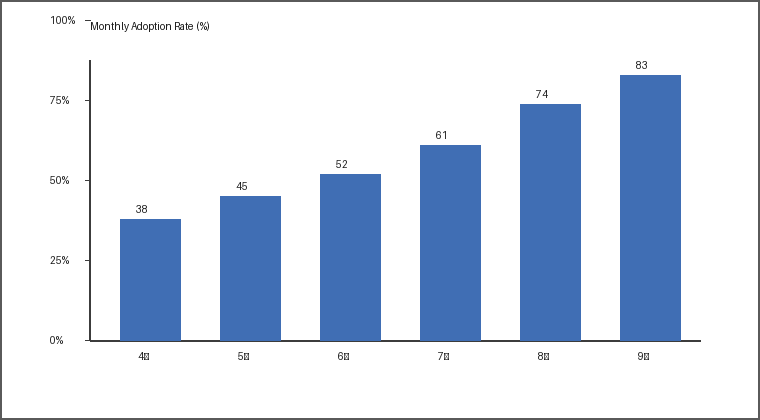

## 현황
- 2026년 4월 정식 개통한 모바일 통합민원 앱의 주민 이용률이 9월 기준 83%에 도달함
- 개통 초기 38%에서 5개월 만에 45%p 상승하였으며, 상승 폭은 7월 이후 둔화되는 추세임

< 그림 1. 월별 앱 이용률 추이(2026년 4~9월) >

- 7월 이후 증가율이 낮아진 것은 신규 이용자 대부분이 이미 가입한 데 따른 자연스러운 포화 현상으로 분석됨

## 이용 행태
- 가장 많이 쓰인 기능은 증명서 발급이며, 전체 이용의 절반 가까이를 차지함

< 표 1. 기능별 이용 건수(2026년 8월) >

| 기능 | 이용 건수 | 비중(%) |
| :-- | --: | --: |
| 증명서 발급 | 41,280 | 47.3 |
| 민원 신청·조회 | 22,910 | 26.2 |
| 세금 납부 | 14,600 | 16.7 |
| 시설 예약 | 8,540 | 9.8 |
| 계 | 87,330 | 100.0 |

60대 이상 이용자의 비중은 11.4%로 인구 구성비(24.8%)에 크게 못 미치고 있어, 고령층 접근성 개선이 다음 과제로 남아 있음.

## 향후 계획
- 10월부터 큰글씨 모드와 음성안내 기능을 추가해 고령층 이용 장벽을 낮춤
- 12월에 이용자 만족도 조사를 실시하여 2027년 기능 개선 우선순위를 정함
