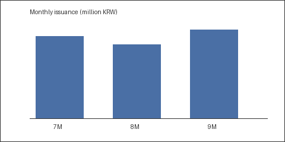

# 지역화폐 발행 추이 분석 (이미지 포함)

## 1. 월별 발행 추이

- 3분기 월별 발행액 추이는 아래 그래프와 같음

- 9월 발행액이 149억원으로 분기 내 최고

## 2. 세부 수치

| 구분 | 발행액(백만원) | 전년동기 | 증감률 |
|:--|--:|--:|--:|
| 7월 | 13,820 | 11,940 | +15.7% |
| 8월 | 12,470 | 12,010 | +3.8% |
| 9월 | 14,910 | 12,880 | +15.8% |

- 명절 특별할인 시행 월의 발행액이 뚜렷하게 높음
