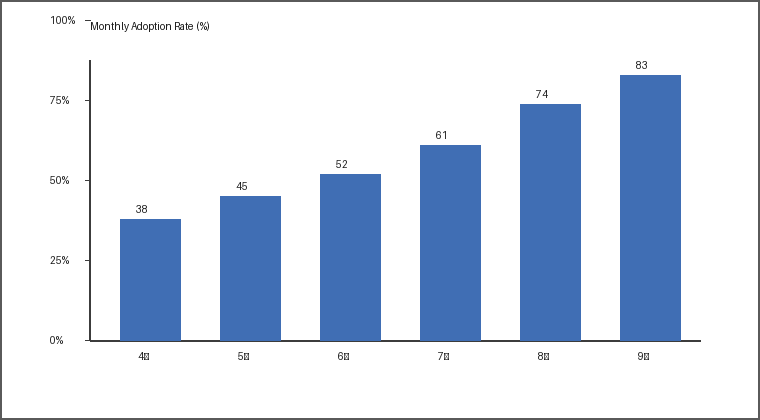

## 추진 배경
- 관제센터 CCTV 4,812대 중 2019년 이전 설치분이 38.6%로 노후화가 진행되고 있음
  - 화질 저하로 2026년 상반기 사건 판독 요청 217건 중 41건이 판독 불가로 회신됨
    - 야간·우천 시 판독 불가 비율이 주간의 2.3배임
- 재난·방범·교통 3개 시스템이 별도 화면으로 운영되어 상황 전파에 평균 6분이 소요됨

## 사업 개요
- (사업 기간) 2027. 1. ~ 2027. 12.(12개월)
- (총사업비) 48억 원(시비 100%)
- (주요 내용) 노후 카메라 교체, 통합관제 플랫폼 구축, AI 이상행동 감지 도입

< 표 1. 연차별 투자 계획 >

| 구분 | 2027년 | 2028년 | 계 |
| :-- | --: | --: | --: |
| 카메라 교체(대) | 1,200 | 660 | 1,860 |
| 플랫폼 구축(억 원) | 21.0 | 4.0 | 25.0 |
| AI 감지(억 원) | 9.5 | 3.5 | 13.0 |
| 계(억 원) | 39.0 | 9.0 | 48.0 |

이 계획은 2026년 12월 시의회 예산 심의 결과에 따라 연차별 물량이 조정될 수 있으며, 조정 시 노후도가 높은 권역부터 우선 교체하는 원칙은 유지함.

## 세부 추진 내용
- (통합 플랫폼) 재난·방범·교통 관제 화면을 단일 상황판으로 통합함
  - 표준 연계 규격(TTA 표준)을 적용해 향후 시스템 추가 시 개발 비용을 절감함
- (AI 감지) 배회·쓰러짐·역주행 등 7개 이상행동을 자동 감지해 관제요원에게 알림
  - 2026년 시범운영 결과 오탐률 4.1%로 목표(5% 이하)를 충족함

< 그림 1. 시범운영 기간 자동 감지 알림 추이 >

□ 시범운영에서 확인된 야간 오탐은 조명 보강과 학습 데이터 추가로 해소함

## 향후 계획
- 2026. 10. 사업 기본계획 확정 및 예산 요구
- 2027. 2. 사업자 선정, 2027. 12. 준공 및 시범운영 개시
