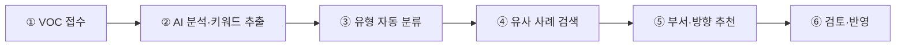

# 제안서 6항목 — 범용 구조·작성 가이드

> 사내 AI 과제 공모·AX 경진대회 신청서에서 널리 쓰이는 기본 뼈대다. 소속 조직의 제출 양식이
> 있으면 그 항목명을 이 6항목에 매핑해 쓴다(대개 명칭만 다르고 구조는 같다). 양식이 없으면
> 이 구조 그대로가 제안서가 된다.

## 항목별 가이드

| # | 항목 | 답해야 하는 질문 | 문체·분량 |
|---|---|---|---|
| 1 | 프로젝트 명 | 무엇을 만드는가 | "AI 기반 ~ 시스템" 관례, 15~25자. 명사형 종결 |
| 2 | 한 줄 소개 | 대상 업무 + AI가 하는 일 + 효과 | 1문장 (예: "고객 VOC를 AI가 자동 분석하여 원인별로 분류하고 개선 아이디어를 추천하는 업무 지원 시스템") |
| 3 | 해결하고자 하는 문제 | "현재 업무에서 어떤 불편함이나 비효율이 있나요?" | 3~5문장. 현재 방식 서술 → 비효율(수작업·반복·시간) → 파급(불일치·누락·이력 단절). "~하고 있습니다 / ~비효율이 발생하고 있습니다" 문체 |
| 4-1 | 제안 솔루션 개요 | AI로 무엇을 어떻게 바꾸는가 | 3~4문장. "생성형 AI를 활용하여 ~합니다. 이후 ~하여 ~를 단축하고 ~를 향상시킵니다" |
| 4-2 | AI 활용 프로세스 및 구조 | 처리 흐름 | 리드 1문장 + **5~6단계 체인**. 각 단계 = 이름(5자 내외) + 설명 1줄. 예: ①VOC 접수 → ②AI 분석·키워드 추출 → ③유형 자동 분류 → ④유사 사례 검색 → ⑤부서·방향 추천 → ⑥검토·반영. 도식 필요 시 같은 체인을 mermaid 로 병기(아래 참조) |
| 4-3 | 활용 AI 도구/기술 | 무엇으로 구현하나 | 실사용 예정만. 예: "Claude 활용 예정", 사내 AI 플랫폼이 있으면 병기. 미확정이면 간결히 |
| 5 | 핵심 기능 | 실제 구현하려는 기능 | 불릿 4~6개, 각 10~20자. 구현 현실성 있는 것만 (예: "VOC 내용 자동 분석 및 유형 분류") |
| 6 | 활용 계획 및 기대 효과 | 어떻게 쓰이고 무엇이 좋아지나 | 3~4문장. 적용 시나리오 → 정량 기대치("주 N시간 → M시간(추정)") → 측정 방법 1줄 → 정성 효과(만족도·일관성) |

## §4-2 mermaid 병기 형식

텍스트 체인과 함께 아래 형태로 준다 — 슬라이드·문서 도구에서 그림으로 렌더링할 수 있다:

## 심사 5축 (셀프 리뷰용 — 공식 루브릭 부재 시 기본값)

문제 구체성 · 정량 근거 · AI 적합성 · 실현 가능성 · 효과 측정 가능성.

## 문체 표본 (§3)

> "현재 고객 VOC는 담당자가 내용을 직접 확인하고 유형을 분류하여 개선 부서에 전달하고 있습니다.
> 이 과정에서 분류 기준이 담당자마다 달라질 수 있으며, 반복적인 수작업으로 인해 많은 시간이
> 소요됩니다. 또한 유사한 VOC가 반복 발생해도 개선 이력이 체계적으로 연결되지 않아 동일한 검토가
> 반복되는 비효율이 발생하고 있습니다."

— 관찰: 통상의 예시 채움본조차 정량(시간·건수)이 없다. **숫자 하나가 들어가면 예시보다 강한
제안서가 된다.**
